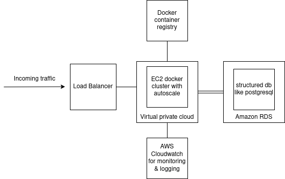

# Schiphol API
This is an API for Schiphol were you can get different data from Schiphol

All flights data you can use the

<code>/flights</code>

Specific flights based on airlineId

<code>/flights/AF</code> where AF is the airlineId

All the airports data

<code>/airports</code>

All the airports data within a certain distance (km/mi) for kilometer or miles

<code>/airports?distanceUnit=100km</code> where 100 is the amount and km can be (km or mi) for kilometers or miles

Specific airport based on id

<code>/aiports/AMS</code> where AMS can be any airport id

All airlines that are flying from schiphol sorted by totalDistance

<code>/airlines</code>

All airlines that are flying from schiphol within a certain area (km or mi)

<code>/airlines?distanceUnit=100km</code> where 100 is the amount and km can be (km or mi) for kilometers or miles

## Run Locally  

Clone the project  

~~~bash  
  git clone https://github.com/jasperjumelet/impalatest.git
~~~

Go to the project directory  

~~~bash  
  cd impalatest
~~~

To install all the dependencies and start the server run

~~~bash  
docker-compose up 
~~~

or if you prefer to run without docker
~~~bash
pip install requirements.txt
python run.py
~~~

## Tests 

Tests can be run 2 different ways.

1. make sure you have requirements installed then locally run
~~~bash
pytest
~~~ 

2. from within a docker container
~~~bash
docker-compose run test
~~~

## Architecture

